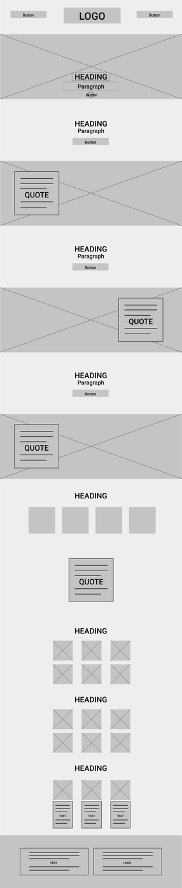
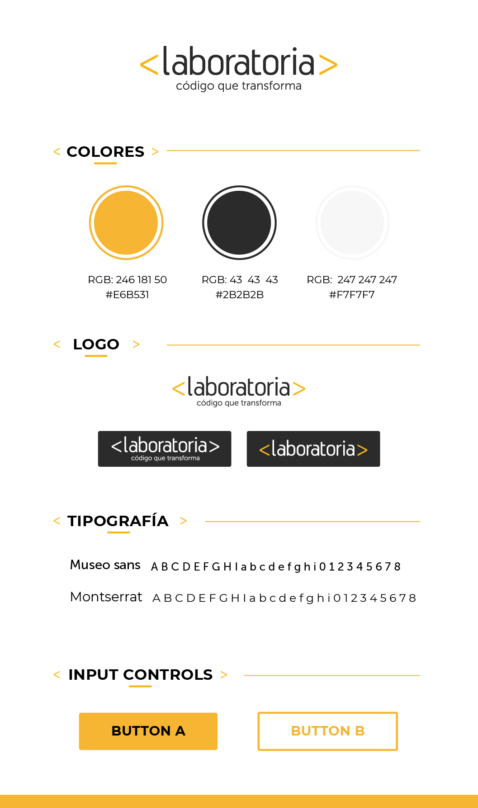
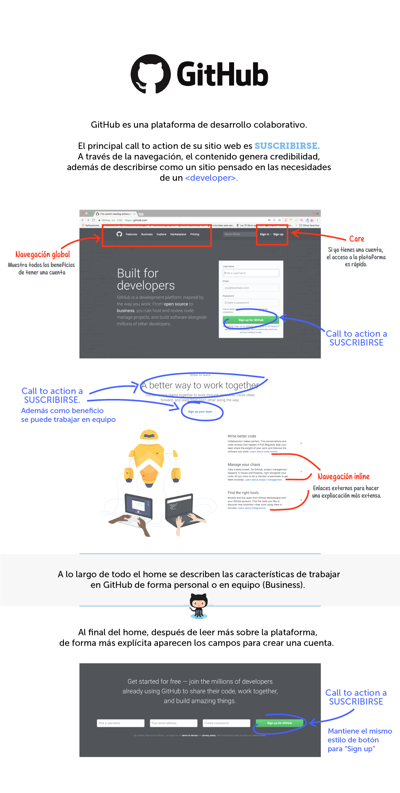
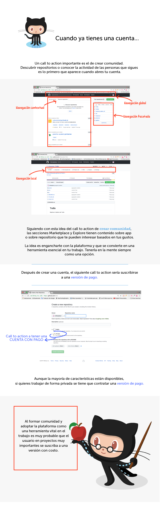
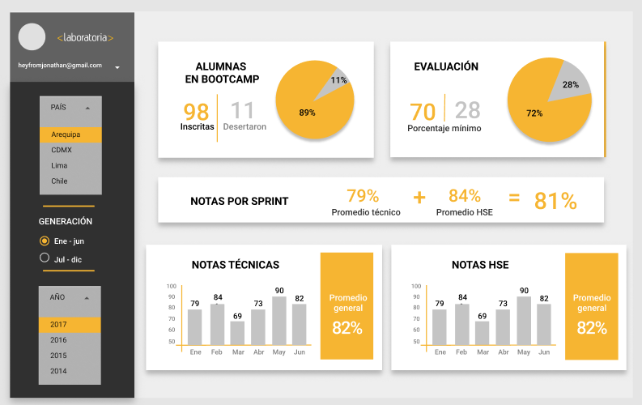
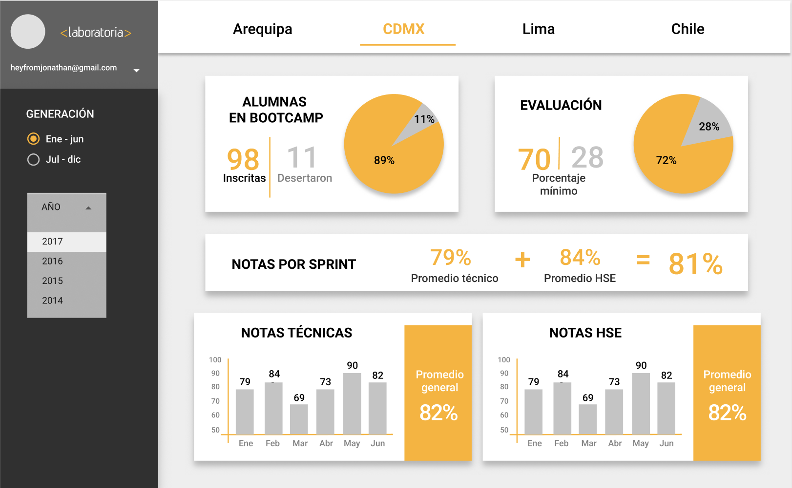

<h1>RETOS UX/UI <h1>

<h2>1. Laboratoria</h2>
<strong>Partes que conforman el UX y el UI.</strong>
<h3>UX</h3>
<h4>Análisis de la competencia</h4>
Existen otros bootcamps de programación que también tienen sitios web. Algo que se destaca es la relación laboral que tienen con otras empresas. Y la numeralia es parte importante de la información.
(https://www.ironhack.com/es
https://devf.mx/)

<h4>Plan</h4>
Laboratoria se direfencia al ser un bootcamp que empodera mujeres en el mundo tech. El storytelling son las historias de las mujeres que ya han estudiado en el bootcamp y ahora tienen resultados exitosos.

Las fotografías en el sitio web tienen el mayor peso visual, ya que a través de ellas se generará confianza en el proyecto ya que son historias reales.

El lenguaje que se utiliza es: 

<h5>Wireframe del home de la página de Laboratoria</h5>

 
<h3>UI</h3>
<h4>Guía de estilo de Laboratoria</h4>

<h2>2. GitHub</h2>
Elementos de navegación.

<h2>3. Data dashboard</h2>
Sketch para la herramienta del dashboard de Laboratoria.
<h4>Dashboard A</h4>
 

<h4>Dashboard B</h4>
 

