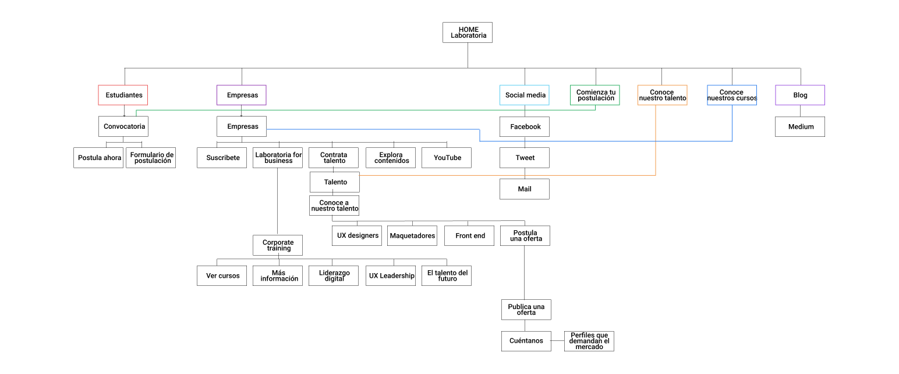

<h1>RETOS UX/UI </h1>

<h2>1. Laboratoria</h2>
<strong>Partes que conforman el UX y el UI.</strong>
<h3>UX</h3>
<h4>Análisis de la competencia</h4>
Existen otros bootcamps de programación que también tienen sitios web. Algo que se destaca es la relación laboral que tienen con otras empresas. Y la numeralia es parte importante de la información.
(https://www.ironhack.com/es y https://devf.mx/)

<h4>Plan</h4>
Laboratoria se direfencia al ser un bootcamp que empodera mujeres en el mundo tech. El storytelling son las historias de las mujeres que ya han estudiado en el bootcamp y ahora tienen resultados exitosos.

Las fotografías en el sitio web tienen el mayor peso visual, ya que a través de ellas se generará confianza en el proyecto, al ser historias reales generan ilusión de estar en su lugar.

El lenguaje que se utiliza es un tú a tú para establecer que te están buscando a ti, que te están hablando directamente, que puedes identificarte con alguna alumna.

Existen 3 call to action: 
   - Postularse como alumna.
   - Contratar a talento Laboratoria.
   - Contratar un curso como empresa.

Para crear credibilidad, en cada call to action va una imagen de persona con un quote donde da testimonio de lo que se vivió en ese caso.

También los logos que aparecen dan un sentido de creencia en el proyecto ya que son lazos que se han trabajado a través de su trayectoria.

<h5>Sitemap de Laboratoria</h5>

<h5>Wireframe del home de la página de Laboratoria</h5>

<h3>UI</h3>

La esencia de la interfaz tiene una clara jerarquía para textos.

<h4>User Interface elements</h4>
Existen muy pocos elementos para que el usuario interactue con la página. Los que se encuentran son:

   -Input controls:
   
      *Buttons (empresas, estudiantes).
      
      *Text fields (formulario de postulación).
      
      *List boxes (formulario de postulación).
      
      *Radio buttons (formulario de postulación).
      
      *Dropdown lists (formulario de postulación).

<h4>Guía de estilo de Laboratoria</h4>

<h2>2. GitHub</h2>
Elementos de navegación.

<h2>3. Data dashboard</h2>
Sketch para la herramienta del dashboard de Laboratoria.
<h4>Dashboard A</h4>

<h4>Dashboard B</h4>

